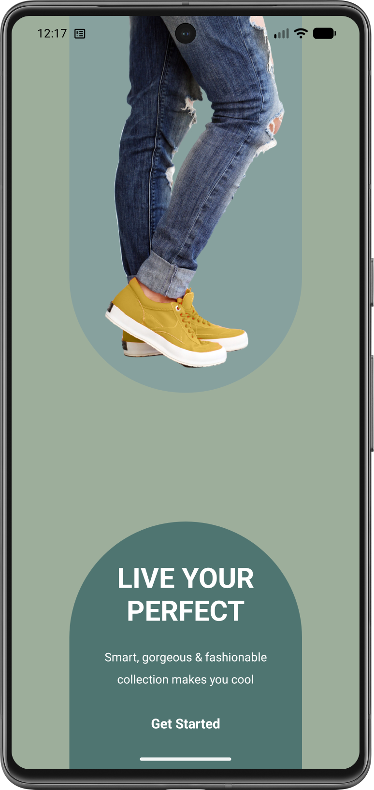
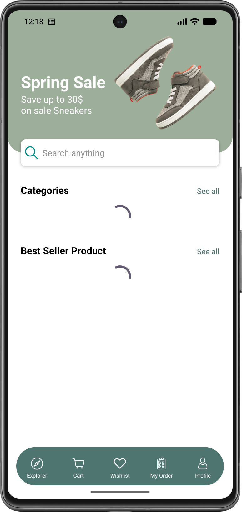
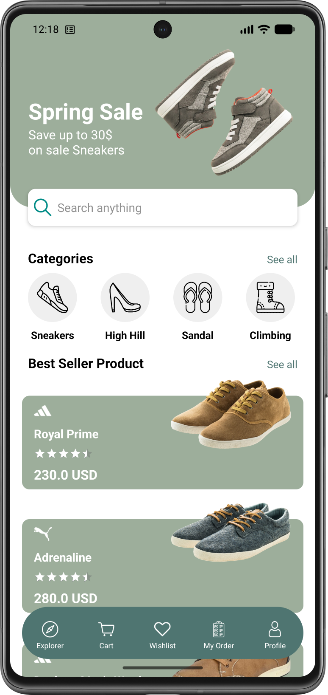
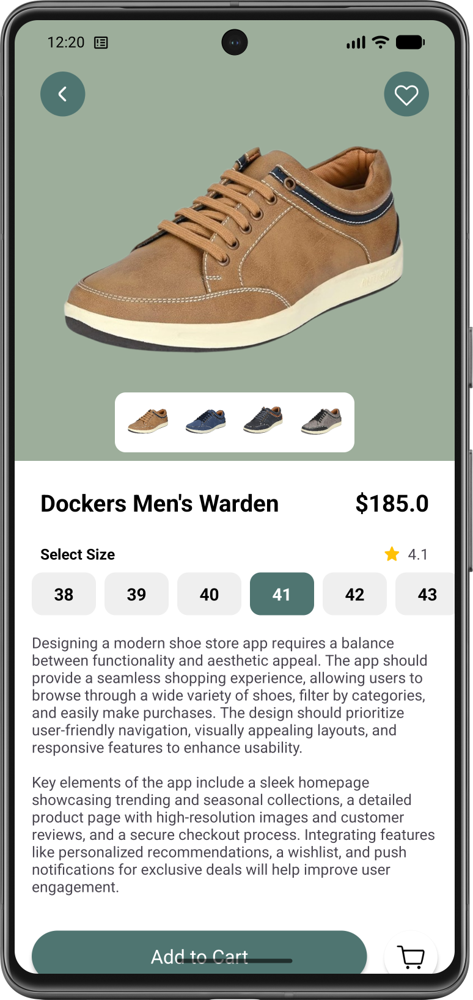
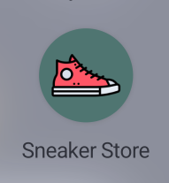
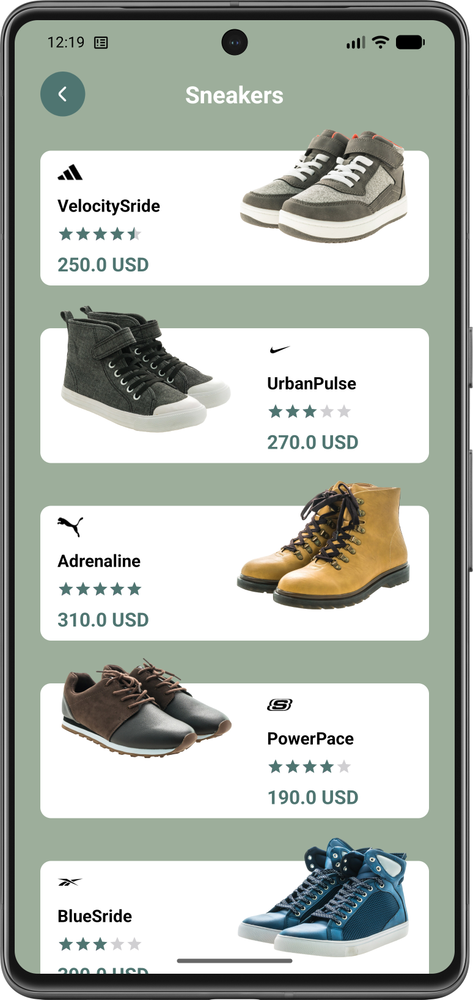
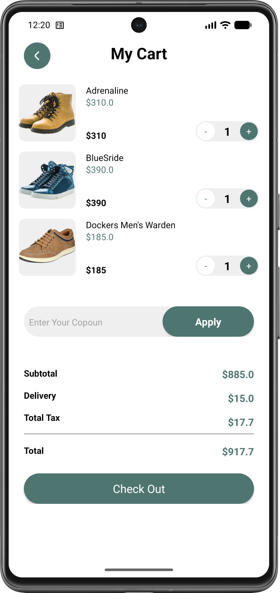
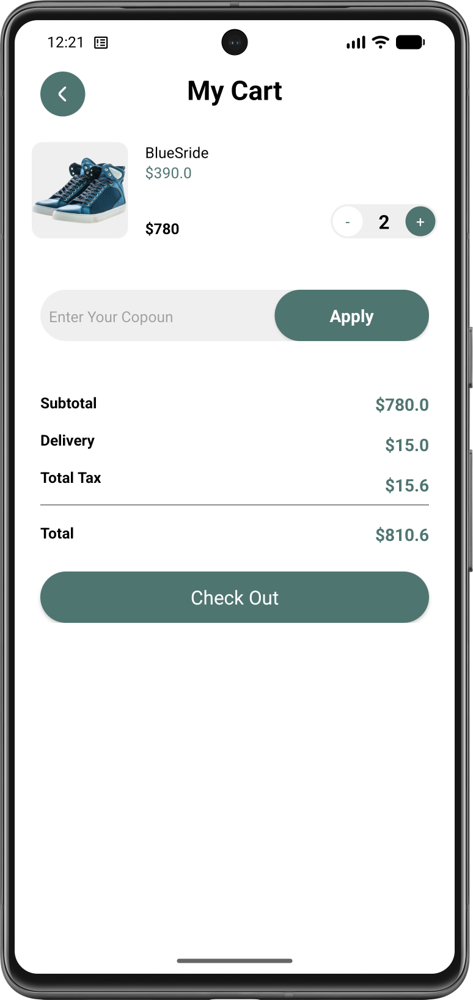

# 👟 Онлайн-магазин кроссовок

Стильный и удобный магазин кроссовок в вашем кармане. Просматривайте категории, выбирайте лучшие модели, подбирайте цвет и размер, и легко оформляйте заказ через корзину. Данные всегда актуальны благодаря Firebase.

---

## ✨ Основные возможности

- **🏠 Стартовый экран** – яркий вход в приложение с мгновенным переходом к покупкам.
- **📱 Главный экран** – популярные категории и подборка бестселлеров. Найдите кроссовки по душе за пару касаний.
- **📂 Каталог по категориям** – выберите категорию и увидите всю обувь в ней с названием, фото, брендом, ценой и оценкой.
- **🔍 Экран товара** – подробная информация: большое изображение, цена, рейтинг, выбор размера и цвета, описание. Кнопка «Добавить в корзину» всегда под рукой.
- **🛒 Корзина** – всегда доступна с нижней панели навигации. Изменяйте количество каждого товара, видите итоговую сумму и стоимость позиций.
- **⏳ Индикатор загрузки** – если данные ещё не получены из Firebase, отображается progress bar, чтобы вы понимали, что приложение работает.

---

## 🛠 Технологический стек

---

## 🎥 Демонстрация работы

  
   
  <em>Просмотр категорий, выбор кроссовок, добавление в корзину и изменение количества.</em>

---

## 📸 Скриншоты

| Стартовый экран | Загрузка товара | Главный экран |
| :------------: | :-----------: | :---------------: |
|  |  |  |

| Экран товара | Иконка приложения | Каталог категории |
| :----------: | :-----: | :-------------------: |
|  |  |  |

| Корзина | Удаление товара из корзины |
| :------------: | :-----------: |
|  |  |

---

## 🧱 Архитектура

Приложение построено по паттерну **MVVM**, что обеспечивает чёткое разделение UI и бизнес-логики.  
**Структура слоёв:**

- **UI (View)** – XML-разметки и Activity/Fragment, наблюдающие за `LiveData` из ViewModel.
- **ViewModel** – подготовка данных, управление состояниями экрана, взаимодействие с репозиторием.
- **Repository** – получение данных из Firebase Realtime Database и предоставление их ViewModel.
- **Model** – классы данных (кроссовок, категория, элемент корзины).

Все данные о товарах, категориях и описаниях загружаются из **Firebase Database** в реальном времени. При отсутствии соединения или длительной загрузке отображается индикатор прогресса.  
Изображения загружаются с помощью **Glide**, что обеспечивает кэширование и плавное отображение.  
Навигация между экранами реализована с использованием явного `Intent` и нижней панели навигации.

---

## ⚙️ Использование

| Действие | Как выполнить |
|----------|---------------|
| **Выбрать категорию** | На главном экране коснитесь любой категории (Например, «Кроссовки» или «Сандали»). |
| **Просмотреть товар** | В списке обуви нажмите на понравившуюся модель. |
| **Подобрать размер и цвет** | На экране товара выберите размер из списка и цвет, если доступен. |
| **Добавить в корзину** | Нажмите кнопку «Добавить в корзину» на экране товара. |
| **Перейти в корзину** | Нажмите иконку корзины на нижней панели навигации. |
| **Изменить количество** | В корзине используйте кнопки «+» и «–» для каждого товара. |
| **Удалить товар** | Уменьшите количество до нуля. |
| **Просмотреть общую сумму** | Внизу экрана корзины отображается итоговая стоимость всех товаров. |

---

## 🚀 Быстрый старт

1. Перейдите в раздел [**Releases**](https://github.com/kerikir/SneakerStore/releases).
2. Скачайте последний APK-файл (`SneakersStore.apk`).
3. **Установка на Android:**
   - Откройте загруженный файл.
   - При необходимости разрешите установку из неизвестных источников (`Настройки → Безопасность → Неизвестные источники`).
   - Завершите установку.
4. Запустите «Sneakers Store» с иконки на рабочем столе.

